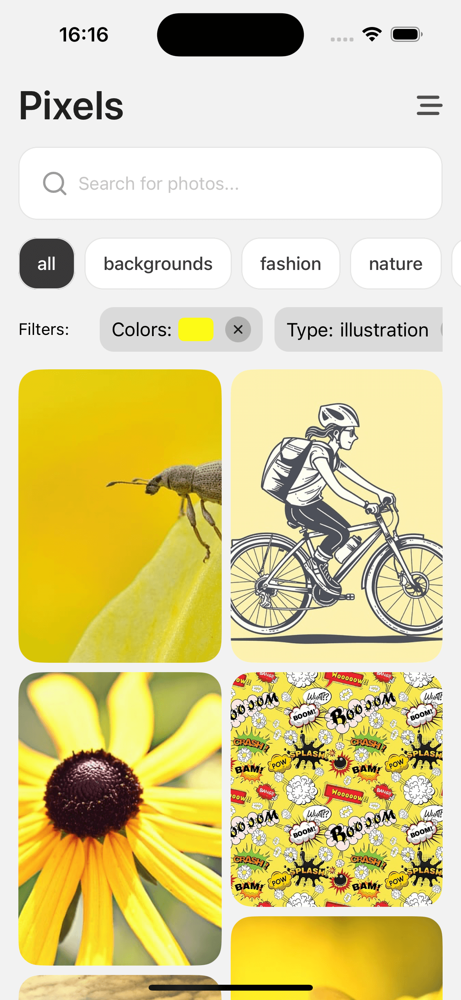

## App List

### Elearning (Hygraph + Clerk)
Video tutorial: [TubeGuriji](https://www.youtube.com/watch?v=zMMcxWORZvg)

> /ELearning

#### Screenshots

    
    
    
    
    
    
    
    
    
    

### Expenses App (Redux + Firebase (Email + Google Auth, Firestore))
Video tutorial: [Code with Nomi](https://www.youtube.com/watch?v=MuiMghr_YZc&list=PLKWMD009Q4qTGuqXxRq51f8OoDaIoJ1yo)

> /Expensify

#### Screenshots

    
    
    
    
    
    
    

### App Store UI
Video tutorial: [Code with Nomi](https://www.youtube.com/watch?v=MuiMghr_YZc&list=PLKWMD009Q4qTGuqXxRq51f8OoDaIoJ1yo)

> /AppStoreUI

#### Screenshots

    

### Login SignUp UI
Video tutorial: [Code with Nomi](https://www.youtube.com/watch?v=MuiMghr_YZc&list=PLKWMD009Q4qTGuqXxRq51f8OoDaIoJ1yo)

> /LoginSignUpUI

#### Screenshots

    
    
    

### Wallpaper App
Video tutorial: [Code with Nomi](https://www.youtube.com/watch?v=Feqq9e04svw)

> /WallpaperGallery

#### Screenshots

    
    
    
    
    
    
    

